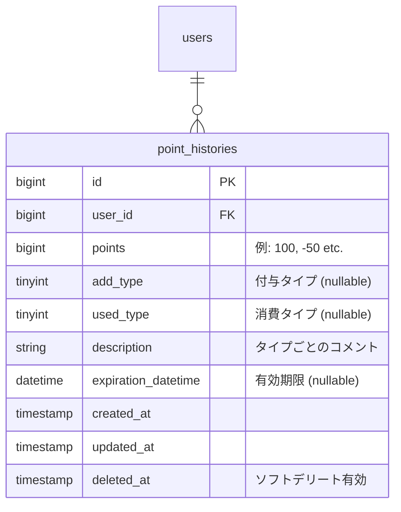
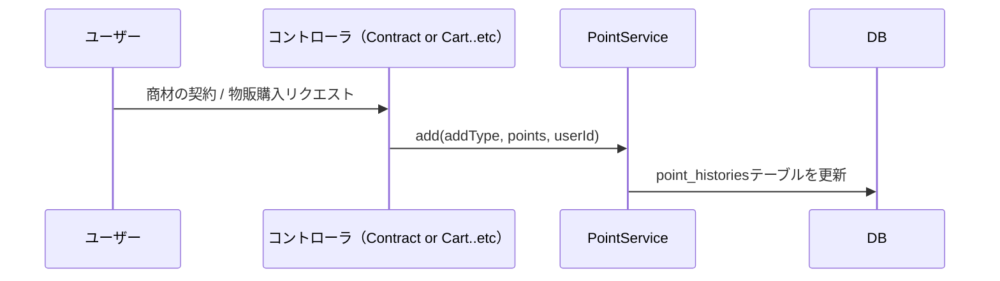
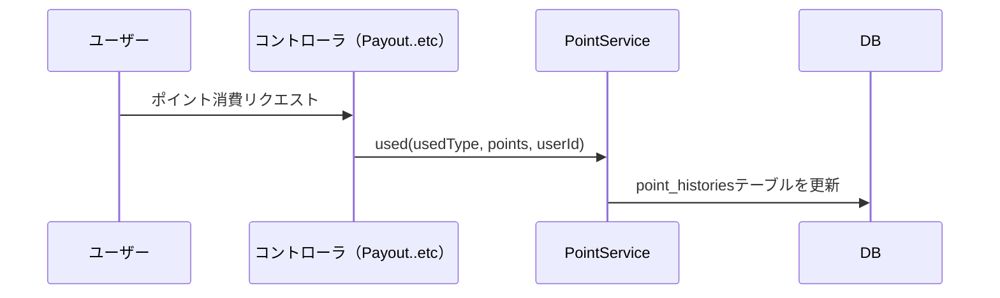

# 課題

とあるToC向けのWebアプリにてポイント機能を開発します。<br>
どのような仕様・設計・実装で開発するか考えてください。<br><br>
ポイント付与のタイミングは、商材の契約時や物販購入時で、ポイントは1ポイント=1円相当で利用できます。<br>
ただし、付与されるポイントには有効期限があります。<br>
開発はLaravel、MySQLを使う想定です。

# 仕様

- ポイントについて
  - 付与と消費ができる。
  - 付与や消費のタイミングは存在する。
  - 有効期限を過ぎると失効ポイント扱いになる。
    - 有効期限は1年間とする。
    - 消費は有効期限が短い付与ポイントから消費される。

# 設計

- ポイントの付与や消費を管理する、ポイント履歴テーブルを追加。（`point_histories`）



# 実装

以下の2つのクラスを追加。

### 1. ポイントの定数を管理する`PointConst`クラス

<details>

<summary>コードはこちら</summary>

```php
<?php

namespace App\Constants;

class PointConst
{
    const ADD_TYPE_CONTRACT = 1; // 契約
    const ADD_TYPE_BUY_ITEM = 2; // 商品購入

    const USED_TYPE_PAYOUT     = 1; // ポイント支払い
    const USED_TYPE_EXPIRATION = 2; // 失効

    const ADD_TYPE_DESCRIPTIONS = [
        self::ADD_TYPE_CONTRACT => '施術契約で獲得',
        self::ADD_TYPE_BUY_ITEM => '商品購入で獲得',
    ];

    const USED_TYPE_DESCRIPTIONS = [
        self::USED_TYPE_PAYOUT     => '支払いで利用',
        self::USED_TYPE_EXPIRATION => '有効期限切れ',
    ];
}
```
</details>


### 2. ポイント管理を行う`PointService`クラス

<details>

<summary>コードはこちら</summary>

```php
<?php

namespace App\Services;

use App\Models\PointHistory;
use App\Constants\PointConst;
use Carbon\Carbon;
use Illuminate\Support\Facades\DB;

class PointService
{
    /**
    * 付与処理
    */
    public function add(int $addType, int $points, int $userId): PointHistory
    {
        if ($points <= 0) {
            throw new InvalidArgumentException('points must be positive.');
        }

        return DB::transaction(function () use ($addType, $points, $userId) {
            // 同一ユーザーの履歴をロック
            PointHistory::where('user_id', $userId)->lockForUpdate()->get();

            return PointHistory::create([
                'user_id'          => $userId,
                'points'           => $points, // 正
                'add_type'         => $addType,
                'description'      => PointConst::ADD_TYPE_DESCRIPTIONS[$addType] ?? '',
                'expiration_datetime' => Carbon::now()->addYear(),
            ]);
        });
    }

    /**
    * 消費処理
    */
    public function used(int $usedType, int $points, int $userId): ?PointHistory
    {
        if ($points <= 0) {
            throw new InvalidArgumentException('points must be positive.');
        }

        return DB::transaction(function () use ($usedType, $points, $userId) {
            // ユーザーの履歴をロック
            PointHistory::where('user_id', $userId)->lockForUpdate()->get();

            if ($this->__balance($userId) < $points) {
                return null;
            }

            return PointHistory::create([
                'user_id'     => $userId,
                'points'      => -$points, // 負
                'used_type'   => $usedType,
                'description' => PointConst::USED_TYPE_DESCRIPTIONS[$usedType] ?? '',
            ]);
        });
    }

    /**
    * 失効処理
    */
    public function expire(int $userId): ?PointHistory
    {
        return DB::transaction(function () use ($userId) {
            $now = now();

            // ユーザーの履歴をロック
            PointHistory::where('user_id', $userId)->lockForUpdate()->get();

            // 最新残高
            $balance = $this->__balance($userId);

            if ($balance <= 0) {
                return null;
            }

            // 有効期限が長い順で付与履歴を取得
            $addTypePointHistories = PointHistory::where('user_id', $userId)
                ->whereNotNull('add_type')
                ->orderBy('expiration_datetime', 'DESC')
                ->orderBy('id', 'DESC')
                ->get();

            $rest = $balance; // 残りの残高
            $toExpire = 0; // 失効させるポイントの合計

            foreach ($addTypePointHistories as $pointHistory) {
                if ($rest <= 0) break;

                $addPoints = (int) $pointHistory->points;
                if ($addPoints <= 0) continue;

                // 有効な付与ポイントが、残りの残高の部分のみの場合を考慮
                $take = min($rest, $addPoints);

                // 有効な付与ポイントが、期限切れなら失効対象
                $isExpired = $pointHistory->expiration_datetime
                    ? Carbon::parse($pointHistory->expiration_datetime)->lte($now)
                    : false;

                if ($isExpired) {
                    $toExpire += $take;
                }

                $rest -= $take;
            }

            if ($toExpire <= 0) {
                return null;
            }

            // ポイント失効処理
            return PointHistory::create([
                'user_id'     => $userId,
                'points'      => -$toExpire,
                'used_type'   => PointConst::USED_TYPE_EXPIRATION,
                'description' => PointConst::USED_TYPE_DESCRIPTIONS[PointConst::USED_TYPE_EXPIRATION] ?? '有効期限切れ',
            ]);
        });
    }

    /**
    * 残高を取得
    */
    private function __balance(int $userId): int {
        return (int) PointHistory::where('user_id', $userId)->sum('points');
    }
}
```
</details>


## 付与処理

- 実行タイミング
  - ポイント付与処理が含まれるリクエストが来た時
    - ※ Controllerのaction内で`PointService`をインスタンス化。
- 実行プログラム
    - `ポイント付与タイプ` `ポイント数` `ユーザーID`を引数に、`PointService`の`add`メソッドを実行。
    - `point_histories`テーブルを更新。



## 消費処理

- 実行タイミング
  - ポイント消費処理が含まれるリクエストが来た時
    - ※ Controllerのaction内で`PointService`をインスタンス化。
- 実行プログラム
    - `ポイント消費タイプ` `ポイント数` `ユーザーID`を引数に、`PointService`の`used`メソッドを実行。
    - `point_histories`テーブルを更新。



## 失効処理

- 実行タイミング
    - `Schedule`ファサードを活用し、毎日深夜0:00に実行されるようにスケジュールを定義。
- 実行プログラム
  - ユーザーごとに`PointService`の`expire`メソッドで、失効ポイントを集計。
  - `point_histories`テーブルを更新。

# 補足

### ポイント付与を取り消す場合の処理

返品などでポイント付与を釣り消す場合は、`PointHistory`モデルはソフトデリートが有効なので`delete`メソッドで論理削除する。